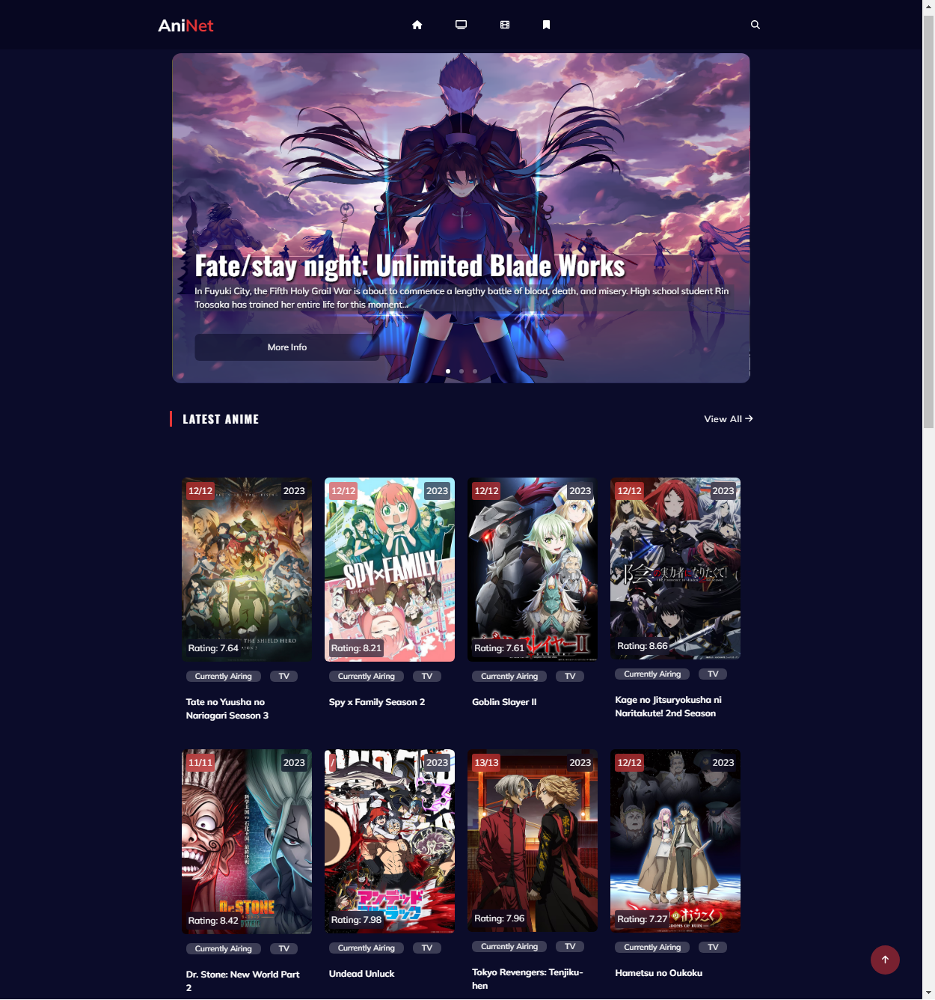

# AniNet
A web application to discover, search and explore anime titles with detailed information

## Table of contents

- [Overview](#overview)
  - [Links](#links)
  - [The challenge](#the-challenge)
  - [Screenshot](#screenshot)
- [My process](#my-process)
  - [Built with](#built-with)
  - [What I learned](#what-i-learned)
  - [Continued development](#continued-development)
  - [Useful resources](#useful-resources)
- [Author](#author)

## Overview

Welcome to AniNet, an online platform designed to help you explore, discover, and delve into the world of anime. AniNet is a web application created with the goal of providing an immersive experience for anime enthusiasts. This platform offers detailed information about various anime titles, allowing you to search for your favorites, discover new shows, and explore comprehensive insights.
Whether you're seeking information on anime plots, release dates, or ratings, AniNet has you covered. Our user-friendly interface ensures easy navigation and access to the wealth of anime-related content.
So, come and immerse yourself in the fascinating realm of anime with AniNet.

### Links

- Solution URL: [AniNet Solution](https://github.com/ioangheraszim/AniNet)
- Live Site URL: [AniNet Live](https://ioangheraszim.github.io/AniNet/)

### The challenge

Users should be able to:

- View the optimal layout for the app depending on their device's screen size ✔️
- See hover states for all interactive elements on the page ✔️
- Be able to navigate to different pages ✔️
- Pass anime data to description data page ✔️
- Pass anime data to bookmark page by pressing the bookmark button ✔️
- Save the anime in local storage when bookmarking the anime ✔️
- Toggle viewd or not viewd anime on the bookmark page ✔️
- Fetch Jikan Api data to display anime data for (anime and characters) ✔️
- Search up the fetched anime data by typing name in an input field and display them on a search page ✔️
- Make pagination work to display anime on different pages ✔️
- A button to scroll up to the top of the page when clicked ✔️

### Screenshot

- Desktop Screenshots
  

    
  

## My process

### Built with

- Semantic HTML5 markup
- Tailwind CSS
- Flexbox
- Grid
- Mobile-first workflow
- [React](https://reactjs.org/) - JS library

### What i learned

### Useful resources

## Author

- Website - [Ioan Gheraszim](https://github.com/ioangheraszim)